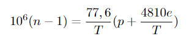
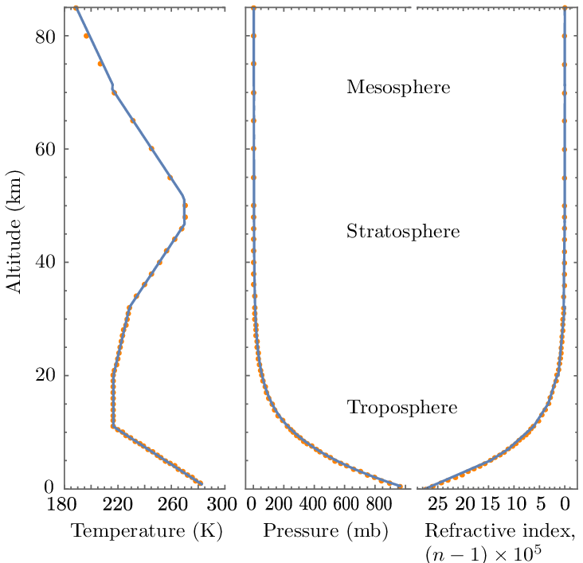
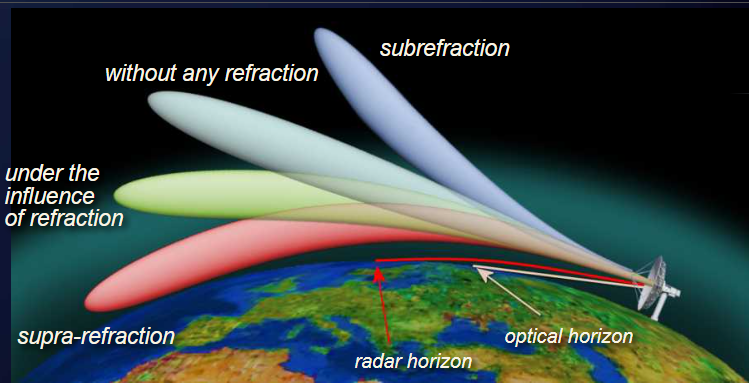

# Condições climáticas

Um dos fatores a ser observado quando se trata da transmissão de ondas eletromagnéticas são condições atmosféricas. Ondas de rádio são refletidas, refratadas, absorvidas, entre outros fenômenos, pelas condições da atmosfera em seu caminho. Esses obstáculos causam distorções e perdas de sinal. Por isso, existem condições ideais para uma boa recepção.

## Troposfera

Camada mais baixa da atmosfera, onde a maior parte dos fenômenos climáticos são observados e também o primeiro meio  de  propagação das ondas provindas da Terra. É nesta área que a temperatura decresce com a subida de altura, o que causa uma mudança no índice de refração do ar, modificando o ângulo do caminho das ondas. O cálculo da refração na atmosfera se dá da seguinte maneira:

Em casos “padrões” a diminuição da refração com o aumento de altitude produz um certo caminho de propagação, no entanto, mudanças climáticas que causam uma menor ou maior queda de refração por altitude modificam esse caminho. Quedas muito bruscas são suficientes para causar a reflexão da onda e mantê-la presa entre uma certa sub-camada da atmosfera e a Terra ou outra sub-camada, possibilitando alcançar pontos normalmente não acessíveis. Esse fenômeno é mais comum durante inversões térmicas (camada baixa fria e seca, camada alta quente e úmida).

## Ionosfera

## Meteor Scatter

em construção.