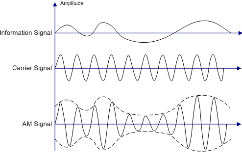

# Modulações

A modulação, dentro de uma tal convenção, consiste em uma operação sobre ondas periódicas para que estas assumam a forma específica de um tal modelo que permita passagem de dados. Essa codificação permite embutir informações em ondas eletromagnéticas. Já a de-modulação ocorre para que possamos compreender o sinal de forma mais fácil, transformando este em som ou algum outro formato visual humanamente perceptível (ou no caso de digimode, que seja decodificado para a máquina, que algum software depois decodifica para a recepção humana).

## Modulações analógicas

Compreende inputs de sinais “naturais”, como a voz humana. A informação a ser modulada é composta de valores que podem variar continuamente.

## AM

Apesar de, atualmente virem perdendo espaço, as rádios AM fazem parte da vida de qualquer pessoa que procura se informar por meio do rádio durante uma comuta diária. Sua sigla vem de amplitude modulation, tipo de modulação analógica que usa a amplitude do sinal para conceber a codificação dos dados.

Apesar de sua popularidade, sinais AM são originalmente pouco eficientes em sua forma padrão. Para isso desenvolveu-se um ramo da modulação analógica chamado SSB (single side-band) que, como o nome diz, possui somente uma banda lateral, diferente da DSB que possui duas. O recebimento do sinal requer maior complexidade pra decodificação, mas o uso de SDR reduz o custo que viria do equipamento necessário. 

## FM 

Comum quando se fala de rádios musicais, o sinal de frequência modulada (FM) transmite informações por meio de mudanças em sua frequência, enquanto a amplitude da onda se mantém a mesma. Comparando FM e AM, o modo de frequência modulada tem maior resistência à interferências EM externas, além de, normalmente, ser mais eficiente energeticamente.

Existem duas variações deste tipo de modulação que trabalham com larguras de banda diferentes do FM padrão: WFM (*wide-band*), mais larga e NFM (*narrow-band*), menor. Dessa forma, WFM permite melhor qualidade de som (maior quantidade de “dados”), mas NFM ocupa menos espaço de banda. Geralmente, NFM é usada com walkie-talkies e outras formas de *two-way radio*, comuns em aplicações militares. Para transmissões de TV usa-se WFM, mantendo melhor fidelidade e qualidade.

Diferentes modulações podem ser utilizadas para quase todas as bandas do espectro de rádio, mas suas diferenças fazem com que sejam adotados padrões nas transmissões. De VHF pra cima, é mais comum o uso de frequência modulada combinada à propagação line of sight. É daí que vem o dito de que “FM não pega tão longe da antena quanto AM” ou “passando do morro a rádio para”. Como AM é mais comum em VHF para baixo, bandas de comunicações normalmente propagadas pelo céu, seu alcance será claramente maior. Em razão da necessidade de FM para uma alocação de frequências bem maior, não faria sentido usá-la em bandas pouco largas, o uso de AM é mais racional. 

## CW

Esta sigla designa “*Continuous Wave*”, e constitui a primeira forma de transmissão de rádio, usada para o Código Morse. Como diz o nome, sua amplitude e frequência são contínuas, e o sinal é ligado e desligado para codificação. Hoje em dia alguns usuários de rádio amador ainda se comunicam por este meio por diversão.

Na maior parte das vezes, as comunicações em CW se dão no começo das bandas e ocupam pouco espaço, utilizando uma largura de banda bem estreita.

(Tecnicamente, código morse é um digimode, mas sua classificação fica confusa dadas as características de seu uso e surgimento).

## Modulações digitais

Os sinais que serão modulados são provenientes de máquinas, tendo valores discretos e variando em intervalos de tempo específicos. Também chamada de **digimode** ou **data mode**, relativamente mais moderna, possibilita separar ruídos indesejados na recepção bem mais facilmente.

Lembrando que essas modulações não se reduzem apenas à comunicação por rádio, mas são utilizadas nas mais diversas aplicações de envio de dados por meio de ondas eletromagnéticas.

## ASK, FSK e PSK

ASK, ou “Amplitude-shift keying” é o termo geral para modulação digital de amplitude. Seu uso mais simples binário (OOK/BASK) considera um sinal “alto” como 1 e a “ausência” de amplitude como 0. No geral, ASK pode ser usado pra conferir à certas sequências específicas de bits uma certa amplitude.

Nesse mesmo estilo se dão FSK e PSK, respectivamente trabalhando com frequência e fase da onda. Nos nomes BFSK e BPSK, o B especifica seu uso binário simples.

## AP(S)K

Os usos mais simples das modulações descritas acima têm limitações em relação à quantidade de informações que podem ser passadas por tempo, e estão sujeitas a interferências e erros na recepção quando se tenta ultrapassar um certo marco de símbolos mandados em pequenos intervalos. Para atenuar esses efeitos, combinações de modos e codificações surgiram, sendo APSK um bom exemplo.

Aqui, amplitude e fase da onda são modificadas, cada combinação representando um símbolo/uma sequência de bits. Sua representação é feita em “constelações” (cada ponto advém de certa amplitude e fase únicas àquela sequência de bits):

A partir dos modos acima surgiram novos digimodes, muitos dos quais desenvolvidos por amadores que, com algum tipo específico de transmissão em mente, criaram codificações específicas, ou seja, protocolos:

Explorando o espectro será comum encontrar esses modos, alguns bem característicos e identificáveis pelos sons e representação gráfica (observar entre os sites sugeridos os sites que auxiliam na identificação). Protocolos, leis e convenções fazem com que certos digimodes sejam encontrados mais comumente em sub bandas específicas. Alguns modos são dedicados ao envio de texto, imagens, etc. Cada qual com sua codificação e tratamento de erros.

Dentre os modos mais antigos estão o RTTY (radioteletype), originalmente ele dependia de uma máquina específica, mas já é encontrado em diversos softwares para comunicação em modos digitais e funciona quase como um fax. Outro tipo muito famoso entre os amadores nos últimos anos é o FT8, eficiente mesmo em más condições de transmissão para estabelecer contatos básicos de longo alcance.