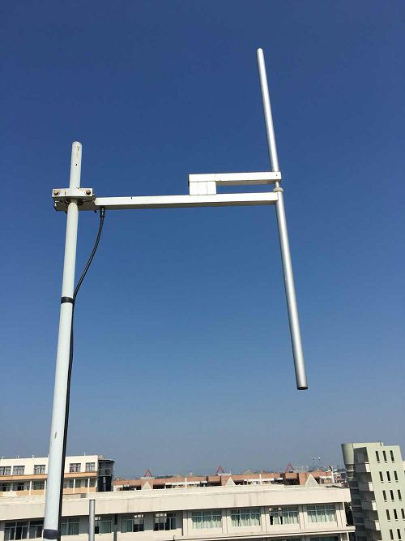

# Antenas

Provavelmente o item mais importante para recepção das ondas eletromagnéticas é ela, a antena. Esses pedaços de metal são importantes demais para evitar, mas complexos o suficiente para querer-se explicar apenas o básico necessário. Para cada tipo de aplicação existe uma antena ideal, porém, felizmente, uma já pode ser o suficiente para receber muitas transmissões. É comum que os kits RTL-SDR já venham equipados com uma antena de dipolo básica, que se estende até no máximo um ou dois metros, ou uma antena monopolo pequena. 

O primeiro passo no entendimento de antenas “simples” está no tamanho delas e sua relação com largura de onda. Ao passo que quanto maior a frequência de uma onda eletromagnética, menor sua largura de onda, bandas de frequências mais baixas requerem antenas maiores. Isso porquê a largura de onda está intimamente ligada com o design do transceptor, principalmente nos monopolos. Essas antenas costumam ter entre metade à um quarto da largura da onda alvo. (Pra entendimento técnico sugiro: [https://en.wikipedia.org/wiki/Mast_radiator](https://en.wikipedia.org/wiki/Mast_radiator)). As monopolo são muito usadas por rádios FM.

## Ganho e SNR

Um dos conceitos de classificação de antenas é o ganho. Simplificadamente, o ganho de uma antena está ligado ao seu alcance relacionado à uma faixa de radiação. Um alto ganho em uma antena de transmissão faz com que seu feixe de ondas transmitidas seja estreito, mas permite que este alcance distâncias mais longínquas. Ou seja, a energia transmitida está focada em um caminho mais “apertado”. No entanto, o maior alcance nem sempre é um ponto positivo, já que quanto maior a distância percorrida pelo sinal, mais interferências no caminho. Essa quantidade de noise é representada pela medida signal-to-noise ratio (SNR), em decibéis. 

## Direção e polarização

Uma antena omnidirecional irradia para todas as direções horizontalmente, sendo as monopolo e dipolos deste tipo. Já as antenas do tipo Yagi-Uda são chamadas de direcionais, mandando o sinal para uma direção específica. 

O conceito de direção da antena não deve ser diretamente confundido com a polarização do sinal. A polarização é especificada a partir da direção do campo elétrico da onda eletromagnética irradiada. Este pode ser classificado como horizontal (EF paralelo à superfície terrestre), vertical ou circular (LHC, rotacionando para à esquerda, ou RHC, rotação à esquerda). Na hora de captar um sinal, sua polarização importa para saber como posicionar a antena.

Por curiosidade, outra antena bem comum de ser vista no dia-a-dia são as antenas parabólicas. Este tipo é considerado direcional de altíssimo ganho, e usado geralmente em transmissões por satélite, radares e em sinais de bem alta frequência, incluindo micro-ondas. Seu sistema é diferente das antenas mais simples, já que usa uma estrutura refletora que leva (ou transmite) o sinal ao foco (aquela parte central). Elas podem ser muito grandes mas estar tratando sinais de largura de onda muito pequena. 