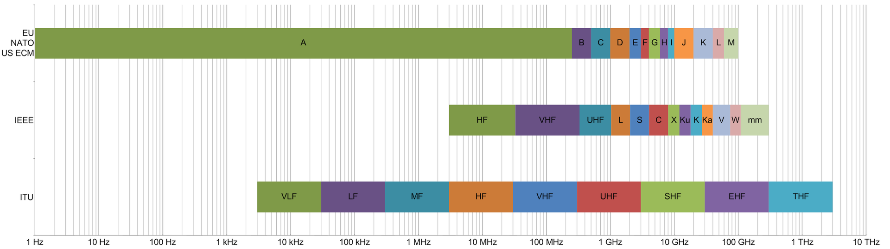
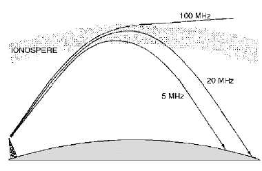

# Bandas de rádio

## O que são bandas de rádio?

As bandas de rádio são seções do espectro eletromagnético designadas para certas funções a partir de certas convenções. As separações são feitas por frequência/comprimento de onda, considerando que no espectro EM a velocidade das ondas é sempre a mesma, caracterizar uma banda por faixa de frequência ou comprimento não faz diferença.

De acordo com a ITU (International Telecommunication Union), as caracterizações usadas são desde ELF (Extremely Low Frequency) com 3 à 30Hz até THF (Tremendously High Frequency) com 300 à 3000GHz. A IEEE segue padrões com nomeação parecida, mas divisão mais específica nas ondas de frequência mais alta (microondas). Geralmente a denominação “ondas de rádio” tem seu limite em algum ponto entre microondas e a faixa infravermelha.

As bandas catalogadas pela ITU tem “larguras” crescentes. Por exemplo, a faixa HF vai de 3 até 30MHz, já a seguinte faixa VHF comporta 30 até 300MHz. Isso se dá por conta da largura de banda usada por diferentes aplicações em cada banda, que costuma ser maior nas faixas com maior energia.

## Mas por que separar?

Sabe-se que a frequência/comprimento das ondas no espectro EM varia com os níveis de energia contidos nestas. As ondas são idealmente propagadas de formas diferentes, algumas são melhor transmitidas mais próximo do solo, já outras por reflexão na atmosfera, etc. Cada aplicação envolvendo transmissão e recepção delas vai trabalhar em uma banda mais adequada. Considerando esses fatores, comunicação telefônica, aviação, envio de dados de satélites meteorológicos e até troca de mensagens entre caminhoneiros em trânsito vão usar certas partes de bandas distintas para evitar interferência advinda de má organização e também procurar as faixas mais adequadas para seu tipo de comunicação.

Atualmente, legislações proíbem transmissões de usuários não registrados e estabelecem especificações para uso de cada banda. É daí que vem o termo “rádios pirata”, caracterizadas por disseminarem sinais sem permissão.

## Características de transmissão de cada banda

Para frequências mais baixas, anteriores as das ondas HF, costuma-se usar meios de propagação próximos a superfície terrestre. Essas ondas podem percorrer distâncias relativamente longas e seguir a curvatura terrestre devido a atrasos causados pela indução na ionosfera e no solo, que fazem com que elas se curvem também. Essa indução no solo também causa perda de energia, e faz com que frequências mais altas se dissipem muito facilmente.

Um uso curioso das faixas mais baixas do espectro é a comunicação com estações abaixo da terra ou fundo no oceano. Como essas ondas tem menores perdas em certas camadas, incluindo a água marítima, elas são comuns em transmissões para submarinos. No entanto, como são (obviamente) usadas bandas de largura limitada (sendo necessária grande largura de onda/pouca frequência), pouquíssimas informações conseguem ser mandadas por vez.

Pouco acima no espectro, se encontram as **ondas HF**, também chamadas historicamente de **short waves**. Nessa banda entre 3 - 30 MHz usa-se a reflexão da ionosfera para transmitir sinais. Essa camada entre Terra e Espaço é cheia de íons causados pelo bombardeamento de elétrons solares. É nesse plasma que certas ondas serão refratadas de volta para a Terra. A reflexão permite que certas transmissões viajem longas distâncias e sejam bem direcionadas, possibilitando comunicação continental ou trans-oceânica.

A interação entre plasma e onda nem sempre resultará nela voltando ao solo, as condições ionosféricas, frequência da onda e ângulo de incidência são fatores a se levar em conta. Frequências mais altas tendem a passar direto pela camada de plasma, enquanto frequências muito baixas são simplesmente absorvidas; mas claro, isso não significa que uma onda de 20 MHz sempre será refratada. Uma transmissão muito verticalizada passará para o espaço sideral bem mais facilmente, tanto como a ionização da ionosfera e outras condições atmosféricas também podem piorar ou inviabilizar sua chegada de volta ao solo.

Finalmente, para **VHF e UHF**, considerando as observações nos outros tipos de propagação mostrados, é comum usar-se *line of sight propagation*, consistindo em antenas altas distribuídas em distâncias menores, trocando informação de forma “verticalizada”. As ondas precisam, literalmente, ser mandadas até distâncias que ainda se consiga enxergar, ou seja, sem interrupção da circunferência terrestre. Para alcançarem espaços além desses é necessária a retransmissão do sinal ou certas condições bem específicas da atmosfera e angulação que permitam leve reflexão.

Em certos casos, para **UHF** e **microondas** usa-se um sistema de transmissão mais comum a aplicações militares, chamado de “tropo-scatter”. Como o nome sugere, camadas superiores da troposfera recebem um feixe bem centralizado de ondas, onde uma pequena parte delas sofre *scattering* e é refletida para uma área bem específica e calculada de volta na Terra. Apesar de útil para evitar interceptações, é pouco eficiente.

E, para deixar claro, essas formas de transmissão não seguem regras tão simples e concretas. As ondas eletromagnéticas dependem de milhares de características internas e externas para propagação. Os meios criados por profissionais são adaptados para cada condição influenciadora, com aplicação de muita técnica, cálculos e predição.

## Uso das bandas

Uma pessoa comum tem maior contato consciente com VHF, banda mais usada para “TV” e “rádio FM”. Algumas comunicações militares também são feitas em faixas específicas nessa banda, e é nela que sinais de satélites de pesquisa e observação costumam retornar diversas informações. Em UHF estão as transmissões que permeiam todos os espaços ocupados atuais, por conta de sua pequena largura de onda, abrigam transmissões de roteadores de internet e celulares, mas não só.  Essas e outras aplicações, como rádio amador, estão espalhadas pelas bandas seguindo a legislação do país ou região em que se está. 

em construção.