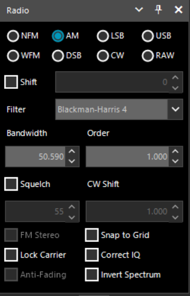
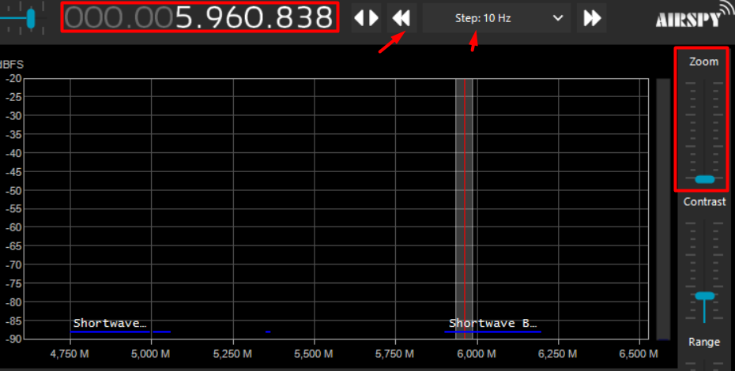
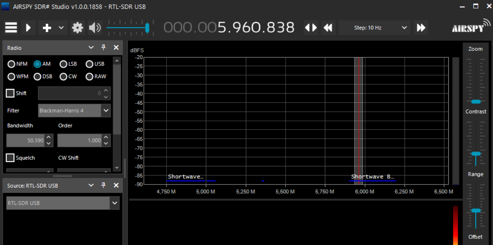

# SDR#

Existem diversos softwares para processamento dos sinais, mas nesse caso, SDR# (SDR sharp) será utilizado, já que conta com funcionalidades diversas e uma interface prática. Também é possível desenvolver e adicionar plug-ins.

## Setup

No canto inferior esquerdo em “source” deve-se escolher o aparelho usado, que nesse caso, é um RTL-SDR USB.

## Tuning

Para **sintonizar a frequência desejada**,  pode-se clicar nos números, começando pela direita com Hertz, e prosseguindo à esquerda para Gigahertz. É possível também utilizar as setas duplas por meio de “jumps” especificados pelos *steps* selecionados no centro da opção. Por meio desses pula-se entre frequências.

Logo abaixo, nas faixas destacadas por sua recepção, também é possível arrastar a visualização pelas bandas com o mouse, seja por clique ou scroll. Para saber a frequência em que se encontra, é só olhar o valor embaixo sinalizado em Megahertz.

Por meio do **zoom**, na direita, é onde se consegue visualizar melhor os sinais no display, possibilitando visualizá-los em mais detalhes.

## Áudio e modulação

Para decodificação do sinal, têm-se na esquerda a escolha de modulações, as quais são explicadas melhor em outra seção. Já “**shift**” é usado para correção da frequência de sintonização, já que em alguns aparelhos sem ajuste por temperatura pode ser necessário. 

Em “**filter**” estão opções de “filtros”, funções geralmente sinusoidais usadas para apodização em processamento de sinais. Esses filtros atuam dentro da largura de banda sintonizada diminuindo interferências de outras estações próximas e outros ruídos. Na seleção “**order**” se aumenta ou diminui a largura dessa função. Quanto maior a ordem, menos interferência deve ser recebida, ainda assim, pode-se acabar perdendo informações da estação desejada.

Clicando na opção “**squelch**” é onde se escolhe suprimir ruído, aqueles barulhos indesejados que, se não muito intensos, podem ser atenuados para que se tenha um melhor entendimento do sinal desejado. O que acontece é que sinais mais fracos são mutados. A intensidade dessa opção pode ser controlada pelo valor logo embaixo. Do seu lado está “**CW shift**”. CW significa *continuous wave*, modo antigo e usado geralmente para código morse. Esse shift constitui a diferença de frequência entre o sinal recebido e transmitido.

“**FM stereo**” habilita som estéreo em rádios FM quando marcado. Já “**lock carrier**” automaticamente centraliza a sintonização na *carrier frequency* (frequência portadora). Uma *carrier wave* (onda portadora) é a onda modulada que “traz” as informações em si, mas a frequência portadora por si só indica a frequência central entre as duas bandas laterais (*double-sidebands*) de um sinal modulado recebido, as quais realmente “contém” a informação. Apenas ativo junto a opção anterior, “**anti-fading**” usa-se da centralização habilitada para evitar que recepções ruins, fracas e atrasadas da rádio sejam ouvidas.

## Opções de display

Ao lado direito do display da intensidade das frequências estão as opções deste. A primeira é o “zoom”, já explicado anteriormente. Em seguida, está o contraste, que serve para aumentar a diferença entre as cores usadas pras intensidades. Embaixo tem-se “range”, que limita ou expande 